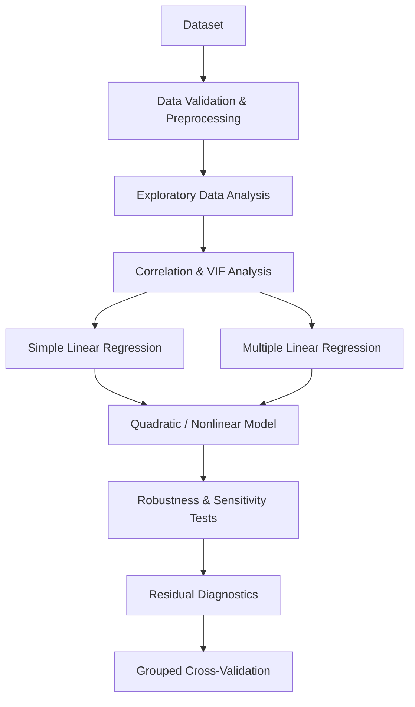

# 🌱 Urban Heat & Green-Cover Impact Modeling

### Statistical Modeling of Urban Vegetation and Land Surface Temperature Anomalies

[](https://www.python.org/)
[](https://jupyter.org/)
[](https://pandas.pydata.org/)
[](https://scikit-learn.org/)
[](https://www.statsmodels.org/)
[](LICENSE)
[](#project-status)

---

## 📌 Overview

**Urban Heat & Green-Cover Impact Modeling** is a research-oriented data science project that investigates the relationship between **urban vegetation** and **Land Surface Temperature (LST) anomalies**.

Rather than optimizing purely for predictive accuracy, the project focuses on **understanding and quantifying** the statistical association between vegetation and urban heat, after accounting for other measurable environmental and urban characteristics.

> **Core research question:** How strongly is urban vegetation associated with local surface temperature, after accounting for built-environment and other environmental variables?

The primary vegetation indicator is **NDVI** (Normalized Difference Vegetation Index); **LST anomaly** is the primary response variable.

---

## 🎯 Objectives

- Investigate the relationship between urban vegetation and LST anomaly
- Quantify the association between NDVI and surface temperature
- Control for relevant urban and environmental variables
- Compare simple and multivariable regression models
- Investigate possible nonlinear (quadratic) relationships
- Evaluate multicollinearity among explanatory variables
- Perform statistical and residual diagnostics
- Examine whether residual patterns vary across cities and climate zones
- Evaluate model robustness using grouped cross-validation
- Provide interpretable coefficient estimates rather than relying on prediction metrics alone

---

## 🔬 Research Perspective

A conventional machine-learning project asks: *"Can we predict urban temperature accurately?"*

This project asks a different question: *"What is the estimated association between vegetation and temperature, after accounting for other variables?"*

For example, the analysis aims to produce an interpretable statement such as:

> A 0.1-unit increase in NDVI is associated with an estimated **X °C** change in LST anomaly, holding the other variables in the model constant.

The exact value of **X** is obtained from the fitted statistical model.

This makes the project relevant to: Environmental Data Science · Urban Climate Research · Statistical Modeling · Geospatial Analytics · Sustainability Research · Urban Planning · Climate Adaptation.

---

## 📊 Dataset

The project uses `global_urban_heat_island_2015_2025.csv`, a city-year panel dataset.

| Property         | Value                    |
|-------------------|--------------------------|
| Observations      | 550                      |
| Cities            | 50                       |
| Countries         | 28                       |
| Years covered     | 2015 – 2025              |
| Climate zones     | 15                       |
| Data structure    | Repeated city-year panel |

Because the dataset contains repeated observations per city, records **cannot be treated as fully independent** — this shapes the modeling and validation approach described below.

---

## 🧾 Variables

| Variable | Role | Description |
|---|---|---|
| `lst_anomaly_c` | Target | Land Surface Temperature anomaly (°C) — the primary dependent variable |
| `ndvi_mean` | Primary predictor | Mean NDVI — the primary measure of urban vegetation/greenness |
| `impervious_pct` | Urban surface control | Percentage of impervious surface (built environment) |
| `tree_canopy_pct` | Alternative vegetation measure | Percentage of tree canopy, used for sensitivity analysis |
| `pop_density_km2` | Urban-density control | Population density per km² |
| `climate_zone` | Climate control | Climate classification for each city |
| `year` | Temporal variable | Observation year (2015–2025) |
| `city` | Geographic identifier | Used for panel structure and grouped validation |
| `heat_mortality_per_100k` | Reserved for future work | Heat-related mortality per 100k population; not used as a predictor of LST anomaly |

**Primary coefficient of interest:** β<sub>NDVI</sub>, where the estimated association for a 0.1-unit increase in NDVI is `0.1 × β_NDVI`.

### Current data scope

The original research concept also considered elevation, distance from water bodies, latitude/longitude, and a separate built-up-area measure. These are **not available in the current dataset** and are therefore excluded from the current regression specifications (see [Limitations](#-limitations) and [Future Work](#-future-work)).

---

## 🧠 Methodology



---

## 📐 Statistical Models

### 1. Simple linear regression

Evaluates the unadjusted relationship between NDVI and LST anomaly:

$$LST_i = \beta_0 + \beta_1 NDVI_i + \epsilon_i$$

### 2. Multiple linear regression (primary model)

Adjusts for additional explanatory variables:

$$LST_{it} = \beta_0 + \beta_1 NDVI_{it} + \beta_2 Impervious_i + \beta_3 Population_i + \gamma\, Climate_i + \delta\, Year_t + \epsilon_{it}$$

The NDVI coefficient is interpreted conditional on the other variables in the model.

### 3. Quadratic regression

Tests whether the NDVI–LST relationship is nonlinear:

$$LST = \beta_0 + \beta_1 NDVI_c + \beta_2 NDVI_c^2 + Controls + \epsilon, \qquad NDVI_c = NDVI - \overline{NDVI}$$

### 4. City + year fixed-effects model (planned robustness extension)

$$LST_{it} = \beta_1 NDVI_{it} + \alpha_i + \gamma_t + \epsilon_{it}$$

where α<sub>i</sub> are city fixed effects and γ<sub>t</sub> are year fixed effects, focusing on within-city change over time.

---

## 🌿 Main Effect Interpretation

Given a fitted NDVI coefficient β, a 0.1-unit increase in NDVI corresponds to:

$$\Delta LST = 0.1\,\beta$$

> **Interpretation template:** A 0.1-unit increase in NDVI is associated with an estimated **X °C** difference in LST anomaly, conditional on the other variables included in the model.

Every reported effect is accompanied by: estimated coefficient · standard error · 95% confidence interval · p-value · model specification.

---

## 🔍 Multicollinearity Analysis

- **Correlation matrix** — identifies strong relationships between continuous variables.
- **Variance Inflation Factor (VIF)** — flags potential multicollinearity, which is particularly relevant since NDVI, tree canopy, and impervious surface measures can be strongly correlated. High multicollinearity increases coefficient uncertainty and complicates interpretation of individual predictor effects.

---

## 🧪 Statistical Diagnostics

| Diagnostic | Purpose |
|---|---|
| Residual vs. Fitted plot | Nonlinearity, heteroskedasticity, systematic prediction error |
| Q-Q plot | Inspect residual distribution |
| Breusch–Pagan test | Assess evidence of heteroskedasticity |
| Durbin–Watson statistic | Initial check for serial correlation (interpreted with care given the panel structure) |

---

## 🏙️ Panel Structure

The dataset contains repeated observations per city across multiple years, so within-city observations cannot be assumed independent. The main regression inference uses **city-clustered standard errors**; the city + year fixed-effects model above is a recommended robustness extension.

---

## 🤖 Model Validation

Prediction is treated as a secondary objective. Because multiple observations belong to the same city, a random train/test split risks information leakage. The project instead uses **city-grouped cross-validation**, so that all observations for a given city fall entirely within either the training or the validation fold — never both.

**Evaluation metrics:**

$$MAE = \frac{1}{n}\sum_{i=1}^{n}|y_i - \hat{y}_i| \qquad RMSE = \sqrt{\frac{1}{n}\sum_{i=1}^{n}(y_i - \hat{y}_i)^2} \qquad R^2 = 1 - \frac{SS_{res}}{SS_{tot}}$$

---

## 📉 Residual Analysis

Residuals ($e_i = y_i - \hat{y}_i$) are examined across cities, climate zones, and fitted values to identify locations or conditions poorly represented by the current model.

---

## 🗺️ Spatial Analysis — Planned Extension

Formal spatial statistics require geographic coordinates, which the current dataset does not provide. Planned extensions include Moran's I and Local Moran's I / LISA for spatial autocorrelation, and spatial lag, spatial error, or Geographically Weighted Regression models, once coordinates are incorporated.

---

## 📁 Repository Structure

```
Urban-Heat-Green-Cover-Impact-Modeling/
├── README.md
├── LICENSE
├── requirements.txt
├── global_urban_heat_island_2015_2025.csv
└── Urban_Heat_Green_Cover_Impact_Modeling.ipynb
```

---

## 🛠️ Technology Stack

| Category | Technology |
|---|---|
| Language | Python |
| Notebook | Jupyter |
| Data processing | Pandas, NumPy |
| Visualization | Matplotlib, Seaborn |
| Statistical modeling | Statsmodels |
| Machine learning / validation | Scikit-learn |
| Planned spatial analysis | GeoPandas, PySAL (libpysal, esda) |

---

## 📦 Installation

```bash
# Clone the repository
git clone https://github.com/SoumyadeepChattopadhyay2004/Urban-Heat-Green-Cover-Impact-Modeling.git
cd Urban-Heat-Green-Cover-Impact-Modeling

# Create and activate a virtual environment
python -m venv venv
source venv/bin/activate        # Windows: venv\Scripts\activate

# Install dependencies
pip install -r requirements.txt

# Launch Jupyter and open the notebook
jupyter notebook
```

Then open `Urban_Heat_Green_Cover_Impact_Modeling.ipynb` and run the cells sequentially.

### Requirements

```
numpy
pandas
matplotlib
seaborn
scikit-learn
statsmodels
jupyter
```

For the planned spatial extension: `geopandas`, `libpysal`, `esda`, `contextily`.

---

## 📌 Key Outputs

Dataset summary statistics · missing-value analysis · distribution plots · NDVI–LST relationship plots · correlation matrix · VIF analysis · regression coefficients with confidence intervals and significance tests · effect-size estimates · model comparison · residual and Q-Q plots · heteroskedasticity diagnostics · city- and climate-zone-level residual summaries · grouped cross-validation performance.

---

## ⚠️ Important Interpretation Note

This is an **observational** statistical analysis: **association ≠ causation**. The estimated NDVI coefficient should not be interpreted as evidence that changing vegetation will causally change LST by the estimated amount.

- ✅ Preferred phrasing: *"associated with,"* *"estimated association,"* *"conditional relationship"*
- ❌ Avoid: *"Increasing NDVI by 0.1 causes LST to decrease by X °C."*
- ✅ Instead: *"A 0.1-unit increase in NDVI is associated with an estimated X °C difference in LST anomaly, after adjustment for the variables included in the model."*

---

## 🚧 Limitations

1. **Observational data** — the project does not establish causal relationships.
2. **Missing geographic variables** — elevation, latitude/longitude, and distance from water bodies are not currently available.
3. **Limited urban morphology** — impervious surface percentage is available, but no separate built-up-area measurement.
4. **Potential omitted variables** — humidity, wind, solar radiation, albedo, building height, road density, surface emissivity, and anthropogenic heat are not comprehensively represented.
5. **Spatial dependence** — formal spatial autocorrelation analysis is not currently possible without geographic coordinates.
6. **Panel dependence** — repeated observations from the same city may be correlated over time.

---

## 🔬 Future Work

- **Geographic enrichment:** latitude, longitude, elevation, distance to water bodies
- **Remote-sensing features:** EVI, LAI, NDWI, NDBI, albedo, surface emissivity, land-cover classes
- **Urban morphology:** building density/height, road density, urban compactness, street-canyon characteristics
- **Meteorological controls:** air temperature, relative humidity, wind speed, precipitation, solar radiation
- **Advanced statistical models:** two-way fixed effects, mixed-effects/hierarchical models, robust panel regression
- **Spatial statistics:** Moran's I, Local Moran's I / LISA, spatial lag/error models, Geographically Weighted Regression
- **Health-impact extension:** using `heat_mortality_per_100k` to study associations between urban thermal conditions and heat-related health outcomes (a separate research question requiring an appropriate health-oriented design)

---

## 📌 Project Status

**🚧 Research / Development**

**Completed:** dataset loading & validation · EDA & descriptive statistics · correlation and VIF analysis · simple and multiple linear regression · clustered standard errors · NDVI coefficient interpretation · tree-canopy sensitivity analysis · quadratic regression · model comparison · residual diagnostics · city- and climate-zone-level residual analysis · grouped cross-validation.

**Planned:** city + year fixed effects · geographic coordinate enrichment · elevation and distance-to-water features · spatial residual mapping · Moran's I / LISA · spatial econometric models · expanded environmental controls · formal research write-up.

---

## 🤝 Contributing

Issues and suggestions are welcome. If you'd like to contribute additional analyses (e.g. spatial models, new controls, or the fixed-effects extension), please open an issue or pull request describing the proposed change.

---

## 📜 License

This project is licensed under the [MIT License](LICENSE) and is intended for academic, educational, and research purposes. If external datasets or third-party resources are incorporated, their original licensing and attribution requirements should be preserved.

---

## 👨‍💻 Author

**Soumyadeep Chattopadhyay**
Data Science · Machine Learning · Statistical Modeling · Environmental Analytics

---

*An interpretable, research-oriented approach to urban environmental data science.*
